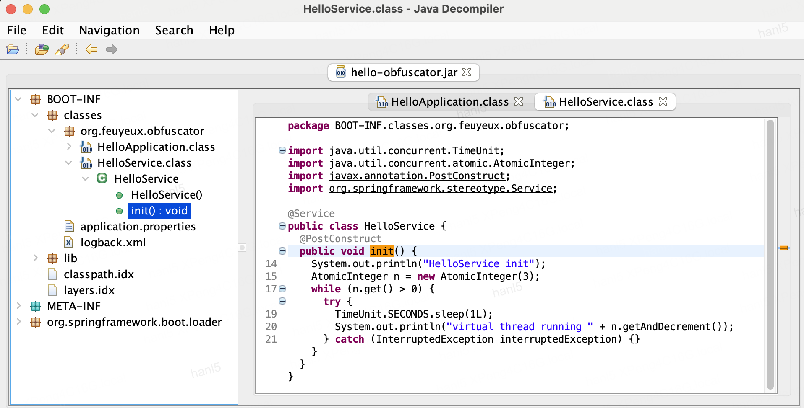

# hello-java-obfuscator

# Without obfuscator

[run.sans.sh](run.sans.sh)

```sh
mvn clean package -DskipTests -f pom.sans.xml
java -jar target/hello-obfuscator.jar
```

```sh
# https://github.com/java-decompiler/jd-gui/releases/download/v1.6.6/jd-gui-1.6.6.jar
java -jar $HOME/Downloads/jd-gui-1.6.6.jar
```



## With obfuscator

```sh
mvn clean package -DskipTests -f pom.avec.xml
java -jar target/hello-obfuscator.jar
```

```sh
# https://github.com/java-decompiler/jd-gui/releases/download/v1.6.6/jd-gui-1.6.6.jar
java -jar $HOME/Downloads/jd-gui-1.6.6.jar
```

## References

- obfuscator: <https://github.com/Guardsquare/proguard>
- decompiler: <https://github.com/java-decompiler/jd-gui>
